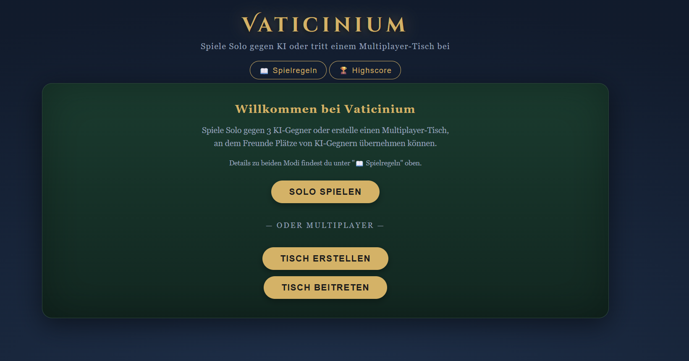
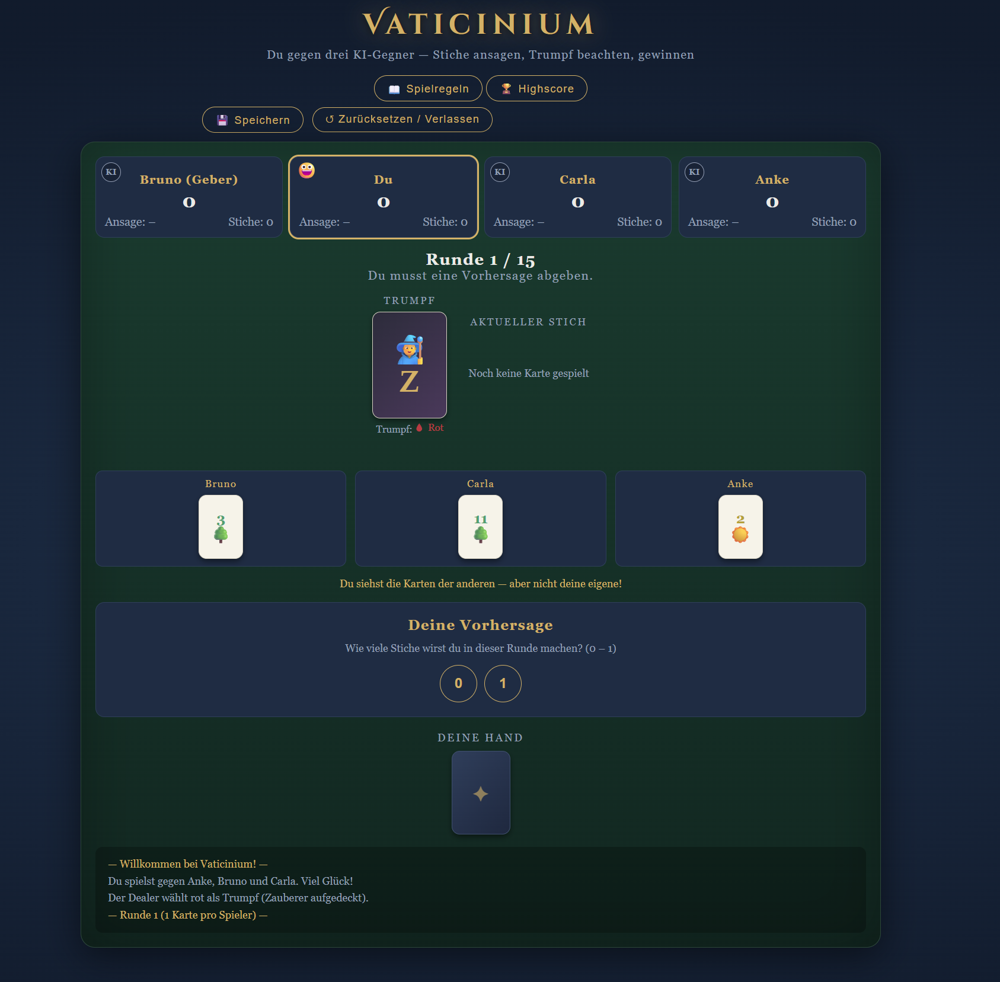
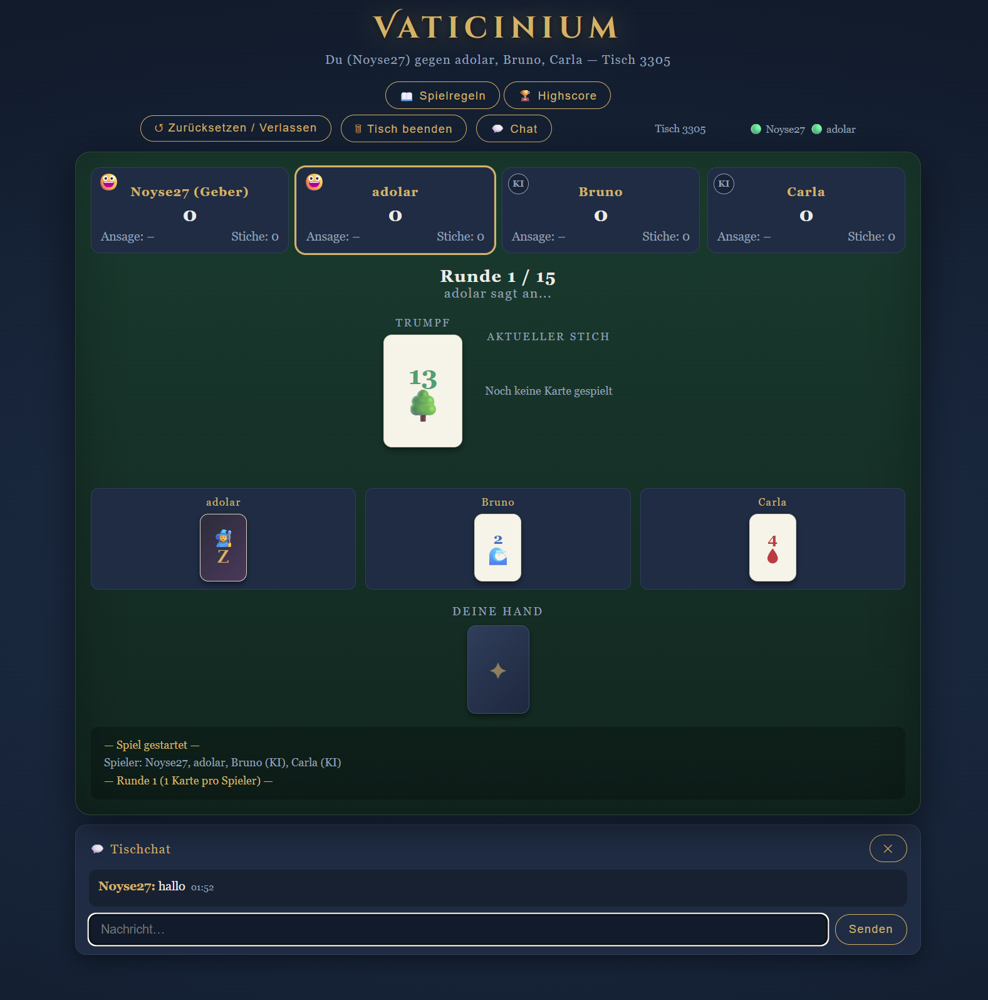
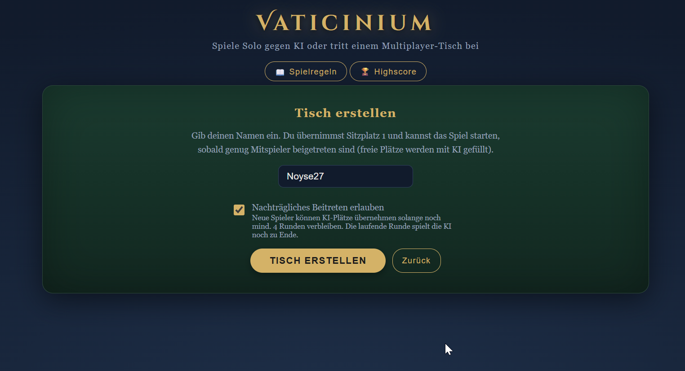
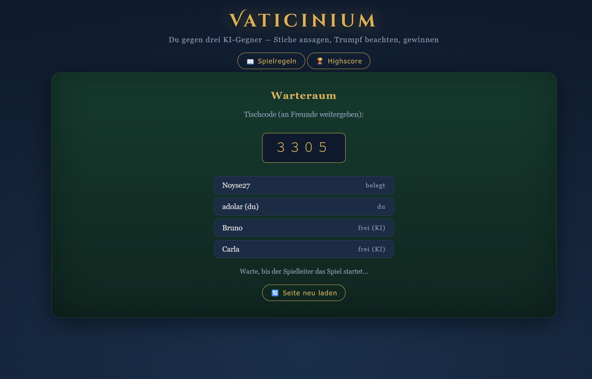

# Vaticinium

<p align="center"></p>

Ein vollständiges Wizard-Kartenspiel im Browser — Solo gegen KI oder Multiplayer mit Freunden über einen eigenen Node.js-Server.



## Features

- **Solo-Modus** — Spiel gegen 3 KI-Gegner mit adaptiver Bietstrategie und menschlichen Unschärfen
- **Multiplayer** — Echtzeit-Mehrspieler über Socket.io ohne Firebase oder externe Dienste
- **Late-Join** — Neue Spieler können einem laufenden Spiel beitreten und einen KI-Platz übernehmen
- **Tischchat** — Integrierter Echtzeit-Chat während des Spiels
- **Highscore** — Bestenliste für Solo-Partien (localStorage)
- **Responsive** — Funktioniert auf Desktop und Mobilgeräten

## Screenshots

### Solo-Modus


### Multiplayer


### Tisch erstellen


### Warteraum


## Spielprinzip

Vaticinium basiert auf dem Wizard-Kartenspiel. Jede Runde sagt jeder Spieler vorher an, wie viele Stiche er machen wird — wer seine Ansage exakt trifft, punktet. Gespielt wird über 15 Runden (bei 4 Spielern).

**Karten:** 60 Karten in 4 Farben (Werte 1–13), 4 Zauberer (gewinnen immer) und 4 Narren (verlieren immer).

**Punkte:** Ansage korrekt → +20 + 10 pro Stich. Daneben getippt → −10 pro Differenz.

## Setup

### Voraussetzungen

- Node.js 18 oder neuer

### Installation

```bash
git clone https://github.com/noyse27/vaticinium.git
cd vaticinium
npm install
node server.js
```

Der Server startet auf Port 3000. Im Browser `http://localhost:3000` aufrufen.

### Port ändern

```bash
PORT=8080 node server.js
```

### Dauerhaft laufen lassen (z.B. Synology NAS)

```bash
# Mit PM2
npm install -g pm2
pm2 start server.js --name vaticinium
pm2 save
```

## Projektstruktur

```
vaticinium/
├── server.js        — Node.js-Server: Spiellogik, Socket.io, Tischverwaltung
├── package.json
├── docs/            — Screenshots
└── public/
    └── wizard.html  — Single-Page-App: Rendering, Solo-Logik, UI
```

## Multiplayer-Architektur

Der Server läuft als autoritäre Instanz — alle Spiellogik (Runden, KI-Züge, Stichauswertung, Punkteberechnung) läuft serverseitig. Clients senden nur Aktionen (`bid`, `play`) und rendern den empfangenen Zustand. Keine Race Conditions, kein Firebase.

```
Client A  ──┐                    ┌──  Client B
            ├──  Socket.io  ──── Server (Spiellogik)
Client C  ──┘                    └──  Client D
```

**Late-Join:** Beim Erstellen eines Tisches kann der Host „Nachträgliches Beitreten" aktivieren. Neue Spieler können dann während einer laufenden Partie einen KI-Platz übernehmen — die KI spielt die aktuelle Runde zu Ende, ab der nächsten Runde übernimmt der Mensch.

## Lizenz

MIT
